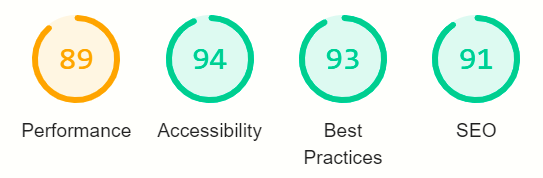
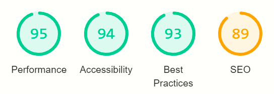

# Capturing Creativity

This site was designed with the expresss purpose of promoting the Irish convention scene, the events 
that take place throughout the year, and the people that make it so special. 

The site (should it operate with more than dummy profiles) would serve to highlight and celebrate 
cosplayers, bring attention to the small press (non-professional comic books) section of Ireland, 
and alert people of all ages and interests about te major conventions taking place during the calender year. 

---

## Website Preview

##### Home

---

## Table of contents

1. [**UX**](#ux)
    - [**Scope**](#scope)
    - [**Structure**](#structure)
    - [**Skeleton**](#skeleton)
    - [**Surface**](#surface)
    
2. [**Features**](#features)
    - [**Existing features**](#existing-features)
    - [**Features left to implement**](#features-left-to-implement)

3. [**Technologies Used**](#technologies-used)

4. [**Testing**](#testing)

5. [**Deployment**](#deployment)

6. [**Credits**](#credits)
    - [**Content**](#content)
    - [**Resources**](#resources)
    - [**Media**](#media)
    - [**Acknowledgements**](#acknowledgements)

## UX

### Scope

The site is made to be a resource for cosplayers, creators, and anyone intested in connecting with people from these scopes of life.

#### User stories

##### Visitor goals

1. As a visitor to the site, I want to learn more about why people cosplay or create comics.
2. As a visitor to the site, I want to discover when and where conventions are going to take place, if they're still going ahead and how to find tickets.
3. As a visitor to the site, I want to be able to contact the site in order to get involved.
4. As a visitor to the site, I want to look at an array of images from Irish conventions.

##### Owner goals

5. As the owner of the site, I want to share the profiles and work of the people of and in Ireland.
6. As the owner of the site, I want to promote the events taking place in Ireland.
7. As the owner of the site, I want to encourage people to get involved in the geekier side of society.

### Structure

The site has been put together using HTML, and CSS.
Bootstrap was installed and used where necessary, such as in implementing the column system for design. 
Navigation through the site can be easily done using the nav-bar in the header.

### Skeleton

Section 1 - Home page - Header with title and navigation on top. 
"Who are we?", "What do we do?", and "Why do we do it?" columns.
Footer- About, link to contact page, and social links.

Section 2 - Events - Identical Header and Footer
About column, an event timeline, and "Next Convention"

Section 3 - Gallery - Identical Header and Footer
A gallery wall of images from conventions

Section 4 - Cosplay - Identical Header and Footer
A list of profiles, "what is cosplay?", "Why cosplay?"
Section 4.1 - Cosplay profiles - List of profiles, a profile

Section 5 - Creators - Identical Header and Footer
A list of profiles, "What do they create?", "Who makes a comic?", a description of the various roles involved in making a comic
Section 5.1 - Cosplay profiles - List of profiles, a profile

Section 6 - Get Involved / Contact page - With the same header and footer, the page is filled with a contact form, requiring the user input their name, email and 
message to the team, before clicking on a styled "submit" button.

**Wireframe**

The initial wireframe

### Surface

**Colours**

Colours used on the site are (without titles):

- #4f1410 : A dark red used on the header and some smaller elements

A variety of greys were used for the menu tabs:
- #353535
- #454545
- #7f7f7f

**Icons** used are from fontawesome.com. They are seen on the fullscreen button and the submit button.

**Images** used were all taken by by the author of the site, Conor Carroll. They are in png format, and have been condensed. 

**Fonts** :

- **Comfortaa** was used for the header, subheading and title mentions.
- **Roboto** was used for all other areas

##### back to [contents](#table-of-contents)

---

## Features

The site is built up of 6 main pages, and 2 sub style pages

### Existing Features

- Navigation through a style nav-bar
- Profiles for generated individuals to simulate the site in full effect
- Clickable links through icons (Spock hand)
- Link to Google map location of "next convention"

### Features to Implement

- Javascript implementation on the contact form
- Filling up the profiles in order to use the secondary navigation
- An endless scroll on the gallery, including a lazy load, as the page grows in size  

 ##### back to [contents](#table-of-contents)

 ---

## Technologies Used

- Languages : HTML, CSS, Bootstrap.

- IDE: [Gitpod](https://www.gitpod.io/)

- Version control: Git on [Gitpod](https://www.gitpod.io/) and [Github](https://github.com/).

- Wireframe: [Balsamiq](https://balsamiq.com/)

- Browser developer tools: Google Chrome

- Fonts : [Google Fonts](https://fonts.google.com/)

- Icons : [Fontawesome](https://fontawesome.com/)

- Images : Canon EOS 2000D

- Image editing : [tinypng](https://tinypng.com/) compression tool.

- Colour tool : https://material.io/resources/color

##### back to [contents](#table-of-contents)  

---
## Testing

Testing was carried out throughout the build process of the site.

### Lighthouse - Google Chrome Developer Tools

- [lighthouse](https://developers.google.com/web/tools/lighthouse) report in Chrome devtools and on command line.

### Bugs encountered

1. The body initially did not fill the screen, leaving the footer to rise up the page. This was 
resolved using the calc(100vh - #) line of code.
2. Images were not scaling initially, with the page. A smaller image size was used, to avoid any issues on smaller screens.
3. Page length was an issue on the Cosplay and Creators pages. A new navigation system was set up, and coded out in the initial page. It is 
there to be used and implemented in the event that the page grows sufficiently to require it. 

### Known issues

1. The social media links, while existent, have failed to navigate in previous testing.
2. The contact form does not do anything, and is for show, currently.
3. There is a medium performnce score on the page, due to the logo and navigation creating a longer page.

### Version control

The site has been committed throughout and previous versions can be viewed on the GitHub [page](https://github.com/ccarroll91/Capturing-Creativity).

### Functionality testing

- Navbar: Links between all pages work successfully

- The link to the social media page works

- Clicking the Google maps link directs to the location on the map

- Clicking the link in the event page at "here" will bring the user to the site of the convention

## User stories

##### Visitor goals

1. As a visitor to the site, I want to learn more about why people cosplay or create comics.
- There is information on the site that tells me about cosplay, and on comic creation, including the various roles involved.

2. As a visitor to the site, I want to discover when and where conventions are going to take place, if they're still going ahead and how to find tickets.
- The information available on the site tells me when and where the next conventions are, and if they are still going ahead.

3. As a visitor to the site, I want to be able to contact the site in order to get involved.
- There is a contact page, but it does not appear to work.

4. As a visitor to the site, I want to look at an array of images from Irish conventions.
- There is a dedicated gallery page.

##### Owner goals

5. As the owner of the site, I want to share the profiles and work of the people of and in Ireland.
- There are a variety of imitation profiles on the site that would be replaced with real people should the project go live.

6. As the owner of the site, I want to promote the events taking place in Ireland.
- Events due to take place in the calender year are highlighted, with the next event given a lot of detail.

7. As the owner of the site, I want to encourage people to get involved in the geekier side of society.
- I have shown the uniqueness of the Irish convention scene, and a variety of images, and have established a contact form with a call to action (although this is yet to be implemented).

##### back to [contents](#table-of-contents)

---
## Deployment

The site was deployed on Github with the use of a use of a Github account, and built 
usig Gitpod.
 For instructions on how to:
 1. Clone:
 - On GitHub, navigate to the main page of the repository.
 - Above the list of files, click  the "down-arrow" and Code button, in green.
 - To clone the repository using HTTPS, under "Clone with HTTPS", click the clipboard icon. 
 To clone a repository using GitHub CLI, click Use GitHub CLI, then click the clipboard icon.
 - Open Git Bash.
 - Change the current working directory to the location where you want the cloned directory.
 - Type git clone, and then paste the URL you copied earlier.
 - $ git clone https://github.com/YOUR-USERNAME/YOUR-REPOSITORY
 - Press Enter to create your local clone.

$ git clone https://github.com/YOUR-USERNAME/YOUR-REPOSITORY
> Cloning into `Spoon-Knife`...
> remote: Counting objects: 10, done.
> remote: Compressing objects: 100% (8/8), done.
> remove: Total 10 (delta 1), reused 10 (delta 1)
> Unpacking objects: 100% (10/10), done.

 2. Fork:
 - On GitHub, navigate to the Capturing Creativity repository.
 - In the top-right corner of the page, click Fork.
 
 ##### back to [contents](#table-of-contents)  

---
## Credits

### Content

Profile content came from a request from two cosplayers and a creator, based on information provided in November 2019 for the Instagram page "Capturing Creativity".

### Resources

- [Bootstrap components](https://getbootstrap.com/)
- [W3schools](https://www.w3schools.com/)
- [Code institute's Slack workspace channels](https://slack.com)

### Media 

- Images were taken by Conor Carroll, the author of this site

 ##### back to [contents](#table-of-contents)  

### Profiles and page length - Cosplay and Creators

The first rendition of the page listed boilerplate profiles "Cosplayer A"-"Cosplayer Z"
in a timeline. The result was a page length that was annoying on a desktop, but downright 
impossible to navigate on a mobile device.

Two steps were taken:

1. The boilerplate names were replaced with fake profiles. While the information
on these profiles is largely the same (only one unique profile exists, Crafty Nathan's Creations)
they are linked to, and represent what the site *could* look like.

2. The site was futureproofed for growth by creating an alphabetical table to navigate
between the pages. This can be seen in both the Cosplay and Creators pages, and the profiles attached:

        <!----------------------------------------------Nav Table
                                    In the event that the page 
                                    grows to require division of 
                                    profiles, this table can be 
                                    uncommented and implemented at a 
                                    moment's notice, linking to two 
                                    near-identical pages for navigating 
                                    between profiles while maintaining the 
                                    overall look and lenght of 
                                    the page-->

                            <!--
                            <table class="table">
                                <thead>
                                    <tr>
                                        <th scope="col" class="left-style-bold">A - H</th>
                                        <th scope="col"><a href="cosplay2.html" class="link">I - P</a></th>
                                        <th scope="col"><a href="cosplay3.html" class="link">O - Z</a></th>
                                    </tr>
                                    </thead>
                                </table>      
                            --> 

    The table was created using Bootstrap.

### Images

Images were made resposive to screen sizes: 

        #circle-container-small{
		    Removed width: 260px;
		    Removed height: 260px;
		    Added min-width: 200px;
		    Added min-height: 200px;
		    Added height: 20vw;
		    Added width: 20vw;
		    padding:0;
		    border-style: solid;
		    border-color: #c62828;
	
		#circle-cosplay1{
		    background: url("../images/cosplay1.jpg") no-repeat center center;
		    height:100%;
		    Added width: 100%;
		    Added object-fit: cover;
		    border-radius: 50%;
		}

### index

The issues with the index.html page lenght were persistent. My initial response was to 
use br tags to space out the page and force the overall lenght of the page down. This was 
a reaction to the page falling short when viewed using the dev tools and an iPad.

This was remedied with a couple of steps.
- A style tag was attached to the Section
     
     style="min-height: calc(100vh-539px);"

  This style tag would take into account the Header and Footer (539px) and the 
  total view height of the page, forcing the lenght of the page down. 

- The section-column was adjusted to also include the vh tag

    
        .section-column {
            display: table-cell;
            padding: 0 30px 30px;
            float: none;
            height: calc(100vh-539px);
            }
    
This would result in the background colours extending the full length of the page.

---

## Roadmap

Future plans for this site include an expansion of the Creators aspect.

1. A preview page for up and coming books would help highlight the work that is being done in the 
background by some of the Creators. This would assist them in advertising their piece and hopefully get 
it into more hands. This page would be a simple
    
    - Title
    - Team
    - Release date
    - Blurb
    - Cover/promotional art

Similarily,

2. A comic book review page. This page would make the overall project feel like it had more integrity, 
and would allow its members a chance to shine and grow. This review page would offer Creators a chance 
to tell thier customers an unbiased opinion about their book.

    - The layout of these review pages would include the information seen in a preview, a progress bar 
chart (Art, Writing, Colours, Lettering, Overall), and a couple of paragraphs about the comic from a 
technical standpoint.

3. The form on the Get Involved page would have a destination. Currently the form does nothing.

---

## Contributing

Currently the page is not looking for further contribution, however, should that change in the future 
one would be required to follow certain steps when creating new material for the site.

- Index - No changes required
- Events - From the events page, one should copy the existing code listed events, and insert new 
events into the calender starting at January to at most 18 months ahead (this is to ensure that events 
early on in the calender year are not ignored or missed).
The *next event* should also be updated regularly, requiring a new Google Map link and About.
- Gallery - The Gallery page is open to the discretion of the site photographers, but each image 
should be at most 3000px (w/h) and should be run through https://tinypng.com/ to reduce the size 
of the image.
- Cosplay / Creators - The two locations share near identical code. A futureproofed line of code 
has been prewritten for both pages, and commented out. This code will change the current layout from an 
Aa-Zz list to an A - H | I - P | Q - Z (built using bootsrap) table menu. In the event that this code has to be 
implemented (growth) all profiles would need to be moved to the correct page alphabetically. Profile pages should 
always display the A - H section. This measure is to ensure the workload for creating a new profile does not 
become tedious.
- Get Involved - A destination for the form is required.

---

## Code Attribution

Initial layout of Rows and Columns sourced from Resume 
Mini-Project for rough rule of thirds. (Matt Rudge)

Changes were made to style and menus thereafter.

Circle layout responsive code sourced from this Stack Overflow page: 
[Stack Overflow](https://stackoverflow.com/questions/41570348/responsive-circle-and-image-fit-on-circle)

---

## Image Attribution

The images marked as "random 1-5 .jpg" were all sourced from a random face generator [https://thispersondoesnotexist.com/]

All other images were taken by/belong to the author of the site.

---

## Technology Used

1. HTML
2. CSS  
3. Bootstrap V4 (https://maxcdn.bootstrapcdn.com/bootstrap/4.2.1/css/bootstrap.min.css)
4. Gitpod / Github
5. Google Chrome Developer Tools

---

## Deployment

Steps used to create this site:

1. The index page was created, and styled.
2. The Header and Footer were reproduced across the site's various tabs.
3. Basic content was added to pages, including images.
4. The gallery wall was created.
5. The timeline objects were created using a "border-left" function
6. The form page was created, using Bootstrap form functions.
7. Various debugging measures were taken, using Google Chrome Developer tools.

This page is deployed using Github pages.

- The branch used is the *master* branch
- The folder used is *root*

In order to clone this repository:

1. Head over to https://github.com/ccarroll91/Capturing-Creativity
2. Find the **Code** button and click the down arrow
3. Usung the clipboard, you can "Clone with HTTPS"
4. Open Git Bash
5. Change your directory
6. git clone and *paste* the url
7. Press ENTER. The clone has been made.

---

## Acknowledgements

- Code institute lecturers
- Bootstrap
- Font Awesome
- https://tinypng.com/
- https://material.io/
- http://techsini.com/multi-mockup
- https://webformatter.com/html

---

## Lighthouse Reports

Mobile Report

Desktop Report

---

## Author

Conor Carroll